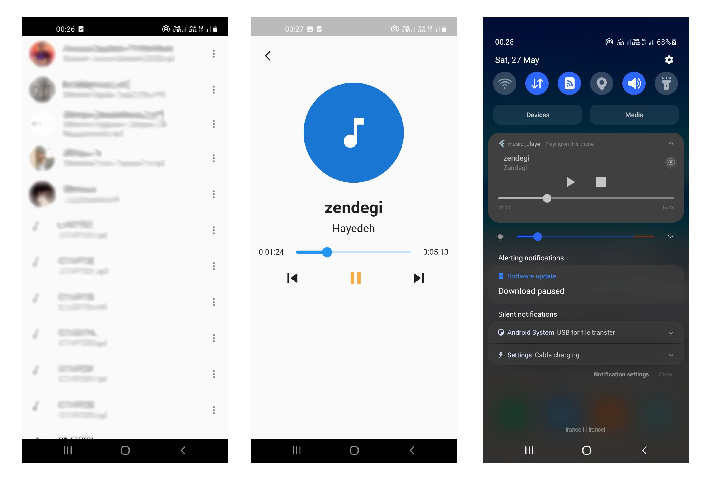

# Flutter-Music-Player

## Introduction

Welcome to the Flutter Music Player repository.
This is NOT a complete ready-to-use music player application but also a half-developed Flutter application that flutter programmers can use as a starting point for their music player apps.
Here, you'll find the project, developed by [Amin Aghakazemi](https://aminakazemi.info).

  

## Installation

To get started with the app, follow these simple steps:

1. Download the repository as a ZIP file.
2. Extract the ZIP file (todo_app.zip).
3. Open the project in your preferred code editor, such as Android Studio.
4. Build the app for your desired platform(s) like Android, Web, or Windows.

## License

This project is licensed under the **MIT License**. For more details, please see the [LICENSE](https://github.com/Amin-Aghakazemi/Flutter-ToDo-App/blob/main/LICENSE) file.
